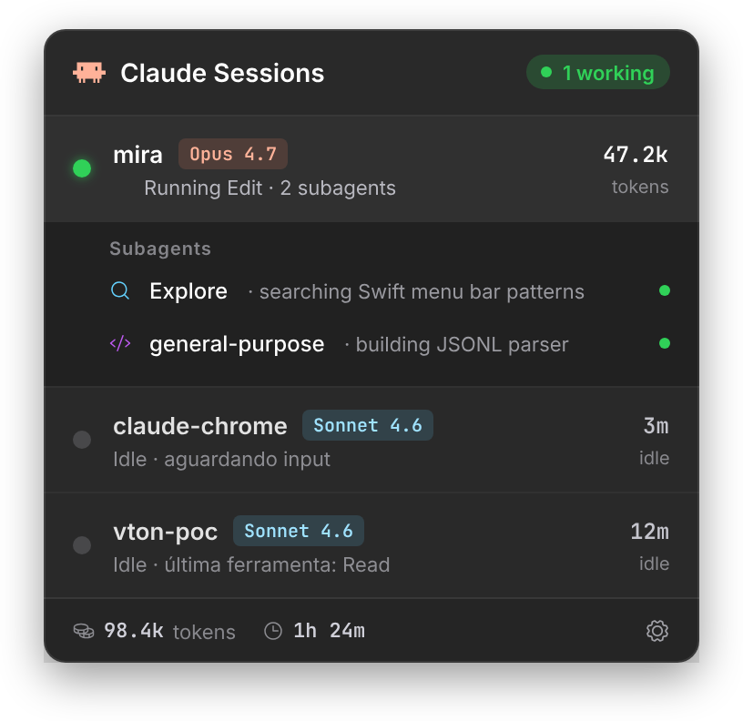
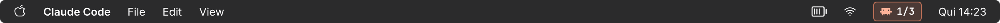

# Claude Sessions — macOS Menu Bar

Mini app nativo pra macOS que mostra na barra de status quantas sessões do Claude Code estão ativas, quais estão trabalhando vs idle, subagentes delegados em cada uma, e os limites de uso da sua assinatura (5h/7d/Sonnet/Opus/extra).



## O que ele faz

Na menu bar aparece o ícone do Claude seguido de `N/M` — `M` sessões totais, `N` trabalhando. Clicando abre um dropdown com duas abas:

- **Sessions** — cada sessão com projeto, modelo, tokens, duração e subagentes ativos. Clicar numa sessão abre o diretório do projeto no Finder.
- **Usage** — janela de 5h (sessão atual), janela semanal de 7d, breakdown por modelo (Sonnet / Opus) e extra usage (pay-as-you-go) com moeda local.



## Requisitos

- macOS 13+ (Ventura ou mais novo)
- Swift 5.9+ / Xcode Command Line Tools
- Claude Code instalado e logado (lê os transcripts de `~/.claude/projects/` e o token OAuth da Keychain)

## Instalação

```bash
./install.sh
```

Esse comando único:

1. Roda `swift build -c release`
2. Monta o bundle `.app` em `build/`
3. Copia pra `/Applications/Claude Sessions.app`
4. Faz ad-hoc codesign + limpa quarentena
5. Abre o app
6. Na primeira execução registra o login item via `SMAppService` — o app passa a subir automaticamente no boot

Pra desativar o auto-start: clica no engrenagem dentro do dropdown > desmarcar "Iniciar no login". Pra desinstalar: `rm -rf "/Applications/Claude Sessions.app"`.

## Detecção precisa de working via plugin (recomendado)

O heurístico de mtime tem um buraco: enquanto o modelo "pensa" (entre o prompt e o primeiro token), nada escreve no transcript e a sessão parece idle. Pra resolver isso tem o plugin companheiro **[`plugin/`](./plugin)** que usa hooks do Claude Code (`UserPromptSubmit` → working=true, `Stop` → working=false, etc) e escreve o estado autoritativo em `~/.claude/sessions-state/<session_id>.json`.

O menu bar app lê esse diretório como source of truth e só cai no mtime como fallback. Instalação (no Claude Code, em qualquer sessão):

```text
/plugin marketplace add hassekf/claude-sessions-menubar
/plugin install claude-sessions-tracker@claude-sessions-menubar
```

Os hooks valem **globalmente** — todas as sessões futuras do Claude Code vão alimentar o state file automaticamente. Sem instalar o plugin, o app cai num heurístico de mtime de 5 min (menos preciso, mas funcional).

Detalhes em [plugin/README.md](./plugin/README.md).

## Como funciona por baixo

**Detecção de sessões.** Faz scan de `~/.claude/projects/<encoded-cwd>/*.jsonl` filtrando arquivos modificados nos últimos 30 min. Se o plugin estiver instalado, `isWorking` vem do state file do plugin; caso contrário, cai no heurístico: uma sessão é "working" se o mtime do JSONL é menor que 2 segundos. Modelo, tokens e `cwd` vêm do próprio transcript. Subagentes ativos são detectados por `tool_use` do tipo `Task`/`Agent` ainda sem `tool_result` correspondente.

**Usage.** Lê o access token OAuth da Keychain (`Claude Code-credentials`, fallback pra `~/.claude/.credentials.json`) e chama `GET https://api.anthropic.com/api/oauth/usage` com `anthropic-beta: oauth-2025-04-20`. Cache de 180s, floor de 30s entre chamadas pra não abusar do rate limit. Abrir a aba Usage força um refresh (respeitando o floor de 30s), então os números ficam sempre frescos quando você olha.

**Ícone da menu bar.** Path do SVG do mascote do Claude foi reescrito à mão como `Shape` SwiftUI e renderizado via `NSImage(size:flipped:)` com `isTemplate = true` — assim o macOS tinta automaticamente de acordo com o tema (dark/light) da menu bar.

## Dev

```bash
swift build                 # debug build
swift run                   # roda direto (sem bundle .app)
./build-app.sh              # monta o .app em build/
./install.sh                # build + install em /Applications
```

Estrutura:

```
Sources/ClaudeSessions/
├── ClaudeSessionsApp.swift       # entry point, MenuBarExtra
├── AppState.swift                # observable state, timers
├── Theme.swift                   # cores + tokens do mockup
├── Models/
│   ├── Session.swift
│   └── UsageSnapshot.swift
├── Services/
│   ├── SessionScanner.swift      # scan de ~/.claude/projects
│   ├── JSONLParser.swift         # parse do transcript
│   ├── CredentialsReader.swift   # Keychain + fallback
│   ├── UsageFetcher.swift        # OAuth usage endpoint
│   └── LaunchAtLogin.swift       # SMAppService wrapper
└── Views/
    ├── MenuBarLabelView.swift    # label da menu bar
    ├── ClaudeMarkShape.swift     # ícone do mascote
    ├── DropdownView.swift        # painel principal
    ├── SessionsTabView.swift
    ├── SessionRowView.swift
    ├── SubagentGroupView.swift
    ├── UsageTabView.swift
    ├── ProgressBar.swift
    └── FooterViews.swift
```

## Privacidade

- Access token OAuth **nunca sai** do teu Mac — é lido da Keychain só pra falar com a API oficial da Anthropic.
- Transcripts do Claude Code são lidos localmente de `~/.claude/projects/` e não são enviados pra lugar nenhum.
- Nenhuma telemetria, nenhum analytics, nenhum network call fora `api.anthropic.com`.

## Limitações conhecidas

- Heurística de "working" de 2s pode marcar uma sessão idle como working se o usuário acabou de enviar uma mensagem. Empiricamente funciona bem.
- `NSPrincipalClass + LSUIElement` make the app agent-style (sem Dock icon). Dock icon volta se `LSUIElement` for removido do `Info.plist`.
- Build atualmente só ad-hoc assinado — distribuir fora do teu próprio Mac exige Developer ID + notarization.

## License

MIT
